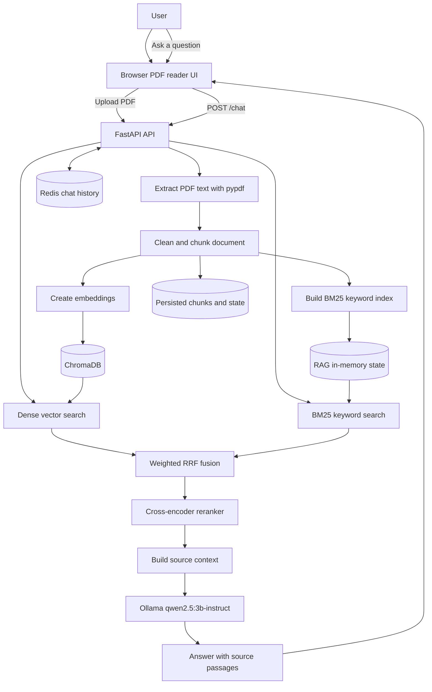

# PDF Reader with Hybrid Search

[](https://www.python.org/)
[](https://fastapi.tiangolo.com/)
[](https://www.trychroma.com/)
[](https://redis.io/)
[](https://ollama.com/)

A local PDF reading and question-answering application powered by
Retrieval-Augmented Generation (RAG). Upload PDF documents, search their
content with hybrid retrieval, and ask questions in a browser chat interface.

The search combines semantic vector search with keyword search, then fuses and
reranks the results before sending the most relevant passages to a local Ollama
model.

## Features

- Upload and read PDF documents from the browser.
- Clean and split documents into overlapping chunks.
- Perform semantic search with ChromaDB and sentence embeddings.
- Perform keyword search with BM25.
- Combine both search methods with weighted Reciprocal Rank Fusion.
- Rerank results with a cross-encoder.
- Ask grounded questions using a local Ollama model.
- Return the answer together with the source passages used.
- Store chat history in Redis for multi-turn conversations.
- Persist indexed chunks and document state on disk.
- Inspect the API through FastAPI Swagger documentation.

## Tools and frameworks

| Purpose | Technology |
| --- | --- |
| Backend API | FastAPI and Uvicorn |
| Frontend | Vanilla HTML, CSS, and JavaScript |
| PDF extraction | `pypdf` |
| Dense retrieval | ChromaDB + `BAAI/bge-small-en-v1.5` |
| Sparse retrieval | `rank-bm25` |
| Hybrid fusion | Weighted Reciprocal Rank Fusion |
| Reranking | `cross-encoder/ms-marco-MiniLM-L-6-v2` |
| Answer generation | Ollama + `qwen2.5:3b-instruct` |
| Conversation memory | Redis |
| Configuration | `pydantic-settings` and `.env` |

## How hybrid search works

For every question, the application uses two complementary retrieval methods:

1. **Dense search** converts the question and document chunks into embeddings
   and searches ChromaDB for passages with similar meaning.
2. **Sparse search** uses BM25 to find passages containing important matching
   words and phrases.
3. **Fusion** combines both ranked result lists using weighted Reciprocal Rank
   Fusion.
4. **Reranking** applies a cross-encoder to score the fused candidates against
   the complete question.
5. **Generation** sends the highest-ranked passages to Ollama as context.

This approach can find both semantically related passages and exact terms,
which is more reliable than using only one search strategy.

## System flow


## Demo


## Project structure
```text
app/
├── main.py                 FastAPI app, startup, shared resources, and UI  route
├── config.py               Environment-backed settings
├── dependencies.py         API-key, RAG, executor, and Redis dependencies
├── memory.py               Redis chat-session storage
├── router/
│   ├── ingest.py           PDF upload and indexing endpoint
│   ├── chat.py             Grounded chat and session deletion endpoints
│   ├── query.py            Retrieval-only /ask endpoint
│   ├── files.py            Uploaded-file endpoint
│   └── health.py           Health and loaded-document endpoint
├── services/
│   └── rag_service.py      Async wrappers around blocking RAG operations
├── rag_pipeline/
│   ├── rag.py              Loading, indexing, retrieval, and persistence
│   ├── loader.py           Text, PDF, and DOCX loaders
│   ├── preprocessing.py    Text cleaning and overlapping chunking
│   ├── dense_search.py     ChromaDB vector store and embeddings
│   ├── sparce_search.py    BM25 keyword index
│   ├── fiuse.py            Reciprocal-rank fusion
│   ├── reranker.py         Cross-encoder reranking
│   └── schema.py           Document and chunk data models
├── schemas/                Pydantic request and response models
└── static/index.html       Browser PDF library and chat UI
app/uploads/                Uploaded PDF files
rag_store/                  Persisted chunks, state, and Chroma data
```


## Requirements

- Python 3.10+
- Redis
- Ollama
- Ollama model `qwen2.5:3b-instruct`

Install the dependencies:

```powershell
pip install fastapi uvicorn pydantic-settings python-dotenv redis chromadb `
  sentence-transformers rank-bm25 numpy python-multipart ollama pypdf `
  python-docx flask groq
```

The embedding and reranker models are downloaded by
`sentence-transformers` on first use.

## Run locally

### 1. Start Redis

```powershell
redis-server
```

### 2. Start Ollama

```powershell
ollama serve
ollama pull qwen2.5:3b-instruct
```

### 3. Start the application

From the project root:

```powershell
uvicorn app.main:app --reload
```

Open the PDF reader at <http://localhost:8000/>.

Useful URLs:

- Web application: <http://localhost:8000/>
- Swagger API docs: <http://localhost:8000/docs>
- ReDoc API docs: <http://localhost:8000/redoc>
- Health check: <http://localhost:8000/health>

